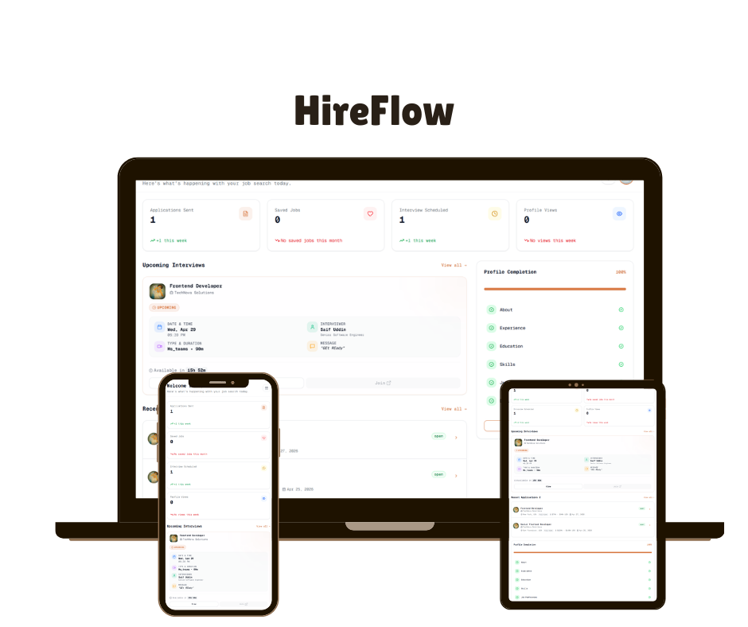

<!-- ================= HEADER ================= -->

<h1 align="center">🚀 HireFlow</h1>
<h3 align="center">AI-Powered Job Recommendation Platform</h3>

<p align="center">
  Find the right job faster with AI-driven resume matching
</p>

<p align="center">
  
  
  
  
  
</p>

<p align="center">
  <a href="https://gethireflow.vercel.app">🌐 Live Demo</a> •
  <a href="#-how-it-works">⚙️ How it Works</a> •
  <a href="#-features">✨ Features</a>
</p>

---

<!-- ================= HERO GIF ================= -->

<p align="center">
  
</p>

---

# ✨ Features

- 🤖 AI Job Recommendations  
- 📄 Resume Upload & Parsing  
- 💳 Subscription System (Stripe)  
- 📊 Dashboard with real-time stats  
- 🔔 Notifications system  
- 🧑‍💼 Employer & Seeker roles  
- 🎯 Smart job filtering & search  

---

# ⚙️ How It Works

```mermaid
flowchart TD

%% ================= AUTH =================
A[User Visits Platform] --> B[Signup / Login]
B --> C{Select Role}

C -->|Seeker| D[Seeker Dashboard]
C -->|Employer| E[Employer Dashboard]

%% ================= SEEKER FLOW =================
D --> F[Browse Jobs]
D --> G[Upload Resume]
D --> H[View Applications]
D --> I[View Interviews]
D --> J[Saved Jobs]
D --> K[Pro Features]

%% ================= RESUME + AI FLOW =================
G --> L[API Match Jobs Trigger]
L --> M[Resume Parser]
M --> N[Extract Skills Experience Education]

N --> O[Fetch Job Listings from DB]
O --> P[Format Jobs for AI]

P --> Q[AI Matching Engine]

Q --> R[LLM Career Coach System]
R --> S[Generate Fit Score 0-100]
R --> T[Apply Decision YES MAYBE NO]
R --> U[Strengths and Skill Gaps]
R --> V[Learning Suggestions]

S --> W[Rank Jobs]
W --> X[Return Recommendations]

X --> Y[Seeker Dashboard Shows Results]

%% ================= APPLICATION FLOW =================
Y --> Z[User Applies to Job]
Z --> AA[Application Stored in DB]
AA --> AB[Employer Receives Application]

%% ================= INTERVIEW FLOW =================
AB --> AC[Employer Schedules Interview]
AC --> AD[Seeker Gets Notification]
AD --> AE[Interview Dashboard Updated]

%% ================= EMPLOYER FLOW =================
E --> AF[Post Jobs]
E --> AG[Manage Jobs CRUD]
E --> AH[View Applicants]
E --> AI[Schedule Interviews]
E --> AJ[Find Talents Pro]

%% ================= PRO FEATURES =================
K --> AK[AI Job Recommendations]
K --> AL[AI Mock Interview System]
K --> AM[Company Insights Access]

%% ================= SYSTEM CORE =================
AN[Stripe Subscription System] --> K
